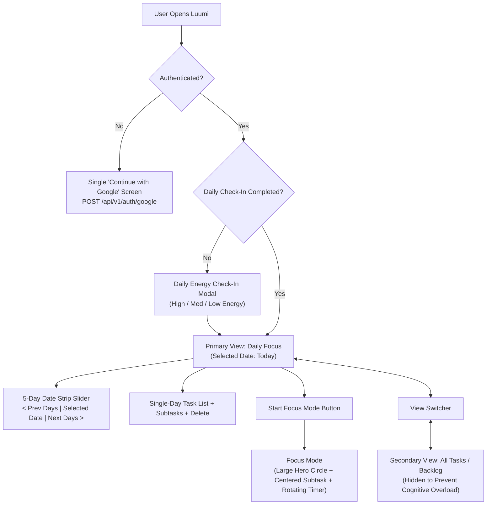

# 🌟 Luumi Web - Minimalist Energy-Aware Productivity Platform

[](https://nextjs.org/)
[](https://react.dev/)
[](https://www.typescriptlang.org/)
[](https://tailwindcss.com/)
[](https://zustand-demo.pmnd.rs/)
[](https://vitest.dev/)

**Luumi Web** is the official web interface for **Luumi** — an intelligent, energy-aware productivity platform designed with a distraction-free **minimalist broken-white aesthetic** (`#FBFBFA` background and sharp black `#111111` typography). Built with **Next.js (App Router)**, **React 19**, **TypeScript**, **Tailwind CSS v4**, and **Zustand**, Luumi connects seamlessly to the **Spring Boot & PostgreSQL** backend with **Google Gemini AI**.

---

## 📑 Table of Contents

- [Visual Identity & UX Philosophy](#-visual-identity--ux-philosophy)
- [Core Behaviors & Features](#-core-behaviors--features)
  - [1. Minimalist Google OAuth Gate](#1-minimalist-google-oauth-gate)
  - [2. Daily Energy Alignment Check-In](#2-daily-energy-alignment-check-in)
  - [3. Primary View: Daily Focus & 5-Day Strip](#3-primary-view-daily-focus--5-day-strip)
  - [4. Focus Mode (Circular Countdown & Centered Subtask)](#4-focus-mode-circular-countdown--centered-subtask)
  - [5. Secondary View: Master Backlog](#5-secondary-view-master-backlog)
  - [6. Gemini AI Goal Decomposer](#6-gemini-ai-goal-decomposer)
- [Architecture & Tech Stack](#-architecture--tech-stack)
- [Project Directory Structure](#-project-directory-structure)
- [Getting Started](#-getting-started)
- [Automated Testing Suite (TDD)](#-automated-testing-suite-tdd)

---

## 🎨 Visual Identity & UX Philosophy

*   **Minimalist Palette**: Built strictly with an off-white / broken-white background (`#FBFBFA`), crisp black typography (`#111111`), hairline borders (`#E4E4E7`), and white cards (`#FFFFFF`).
*   **Energy over Deadlines**: Subtle monochrome badges without noisy colors:
    *   `[ ● AMPLIFY ]` (High Focus / Deep Execution)
    *   `[ ◐ BALANCE ]` (Steady Flow / Standard Delivery)
    *   `[ ○ RESTORE ]` (Mindful Pace / Low Energy Tasks)
*   **AI Seamlessness**: Smooth skeleton shimmer loading states during goal decomposition.

---

## 🚀 Core Behaviors & Features



### 1. Minimalist Google OAuth Gate
- Single-button `"Continue with Google"` authentication card.
- Sends OAuth payload to `POST /api/v1/auth/google`, stores JWT in `localStorage`, and injects `Authorization: Bearer <token>` on all requests.

### 2. Daily Energy Alignment Check-In
- Prompts user on initial session load: *"How is your physical and mental capacity today?"* (`HIGH FOCUS`, `STEADY BALANCE`, `LOW / RESTORE`).
- Adapts the daily energy alignment pill on the header.

### 3. Primary View: Daily Focus & 5-Day Strip
- Strictly displays tasks for a single date (`targetDate === selectedDate`).
- 5-Day interactive horizontal date strip with today indicator and left/right shift controls.
- Top positioned inline Gemini AI decomposer bar.
- Task deletion capability (`DELETE /api/v1/tasks/{id}`).

### 4. Focus Mode (Circular Countdown & Centered Subtask)
- **Large Hero Focus Circle**: SVG rotating countdown progress ring.
- **Centered Active Subtask**: Subtask title is displayed prominently in large bold font in the center of the ring.
- **Step-by-Step Flow**: Focuses on only one active subtask at a time without showing distracting upcoming subtask lists.
- **Completion Celebration**: Fires confetti upon finishing the last subtask.

### 5. Secondary View: Master Backlog
- Dedicated secondary view holding all backlog tasks, isolated from the daily focus view.
- Filterable by energy tier (`ALL`, `AMPLIFY`, `BALANCE`, `RESTORE`) and search keyword.

### 6. Gemini AI Goal Decomposer
- Direct connection to **Google Gemini AI (`gemini-3.6-flash`)**.
- Automatically evaluates energy requirements (`AMPLIFY`, `BALANCE`, `RESTORE`) and generates structured subtasks.

---

## 🏛️ Architecture & Tech Stack

| Category | Technology |
| :--- | :--- |
| **Framework** | Next.js 16 (React 19, TypeScript, App Router) |
| **Styling** | Tailwind CSS v4, Custom Broken-White Tokens |
| **State Management** | **Zustand** (`useAuthStore`, `useTaskStore`, `useEnergyStore`, `useFocusStore`) |
| **Icons** | Lucide React |
| **AI Integration** | Google Gemini AI (`gemini-3.6-flash`) |
| **Testing** | Vitest, React Testing Library, JSDOM, Jest DOM |

---

## 📁 Project Directory Structure

```
luumi-web/
├── src/
│   ├── app/
│   │   ├── globals.css              # Broken-white design tokens
│   │   ├── layout.tsx               # Root Next.js layout
│   │   └── page.tsx                 # Dynamic view routing (Auth vs Dashboard)
│   ├── components/
│   │   ├── AiDecomposeModal.tsx     # Skeleton shimmer AI decomposition modal
│   │   ├── AiDecomposeModal.test.tsx
│   │   ├── BacklogView.tsx          # Secondary master backlog view
│   │   ├── CreateTaskInline.tsx     # Top AI task decomposer input
│   │   ├── DailyCheckInModal.tsx    # Daily energy condition prompt
│   │   ├── DailyCheckInModal.test.tsx
│   │   ├── DateNavigator.tsx        # 5-day horizontal date strip
│   │   ├── DateNavigator.test.tsx
│   │   ├── GoogleAuthScreen.tsx     # Single-button Google login card
│   │   ├── GoogleAuthScreen.test.tsx
│   │   ├── Dashboard.tsx            # Main focus dashboard container
│   │   ├── TaskItem.tsx             # Task card with delete button & checklist
│   │   ├── TaskItem.test.tsx
│   │   ├── FocusModeModal.tsx       # Large centered subtask & rotating countdown
│   │   └── FocusModeModal.test.tsx
│   ├── lib/
│   │   ├── api.ts                   # Fetch client with Bearer token header
│   │   └── api.test.ts
│   ├── store/
│   │   ├── useAuthStore.ts          # Zustand store for Google auth & JWT
│   │   ├── useAuthStore.test.ts
│   │   ├── useEnergyStore.ts        # Zustand store for daily energy check-in
│   │   ├── useEnergyStore.test.ts
│   │   ├── useFocusStore.ts         # Zustand store for timer & subtask step runner
│   │   ├── useFocusStore.test.ts
│   │   ├── useTaskStore.ts          # Zustand store for single-day tasks, CRUD, delete
│   │   └── useTaskStore.test.ts
│   ├── test/
│   │   └── setup.ts                 # Vitest test environment configuration
│   └── types/
│       └── index.ts                 # TypeScript domain interfaces
├── package.json
├── tsconfig.json
└── vitest.config.ts                 # Vitest configuration
```

---

## 🚀 Getting Started

### Prerequisites
- **Node.js**: `v20.x` or `v24.x`
- **npm**: `v10.x` or `v11.x`
- **Spring Boot Backend**: Running on `http://localhost:8080`
- **PostgreSQL**: Running on port `5432`

### Setup & Run

```bash
# Navigate to luumi-web directory
cd luumi-web

# Install dependencies
npm install

# Start Next.js development server
npm run dev
```

Open [http://localhost:3000](http://localhost:3000) in your browser.

### Automated Testing (TDD)

```bash
npm test
```
